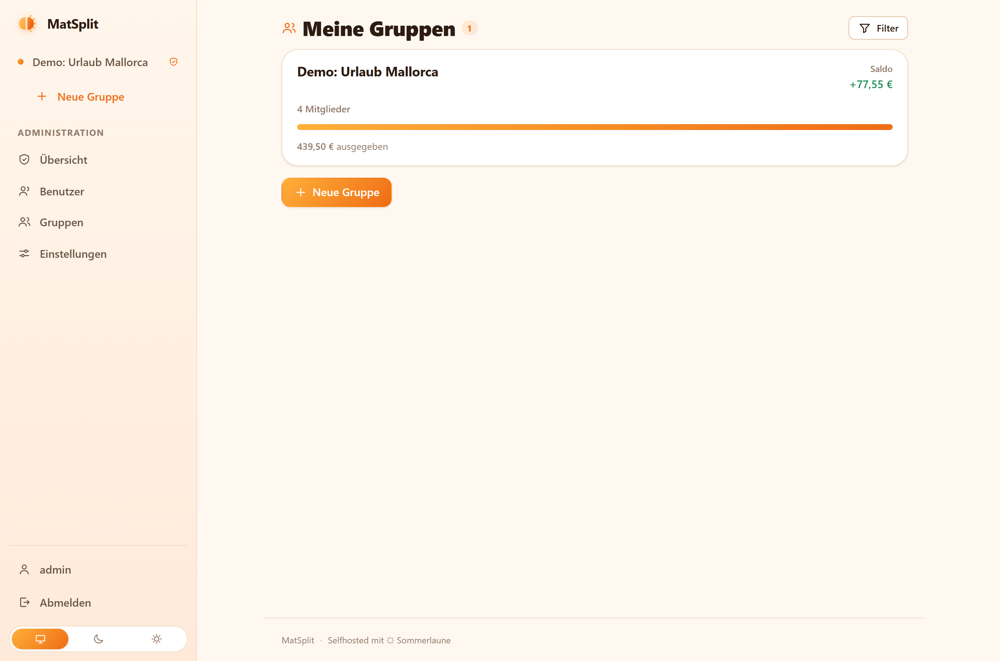
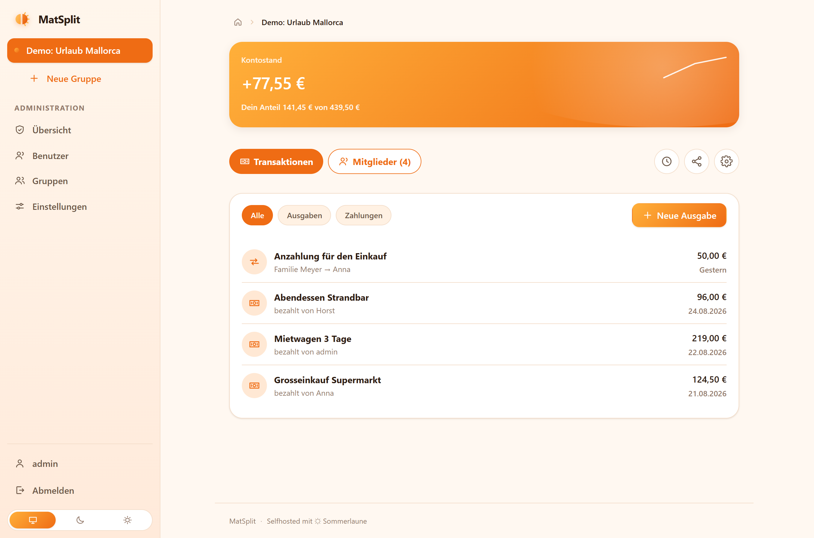
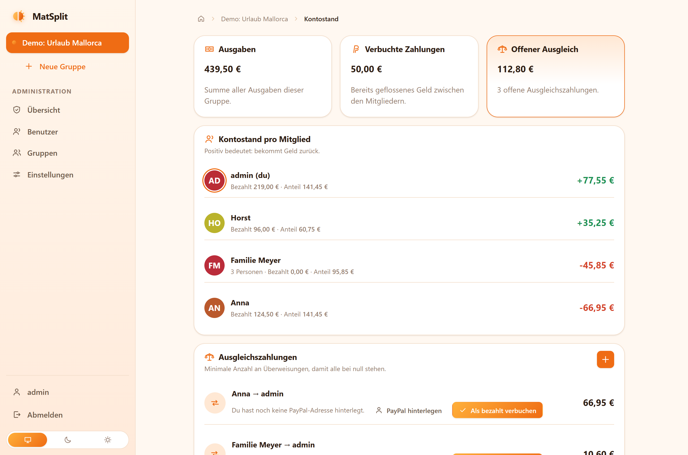
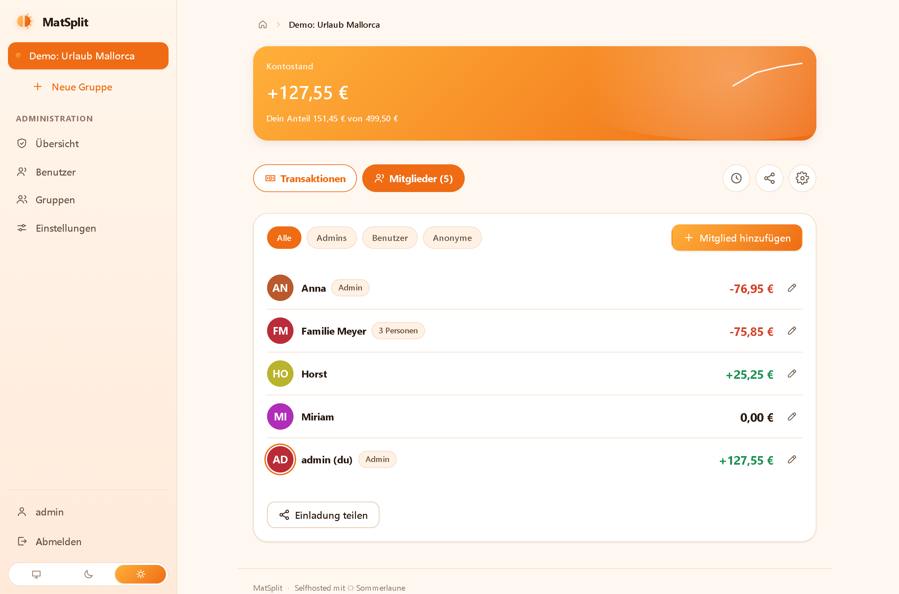
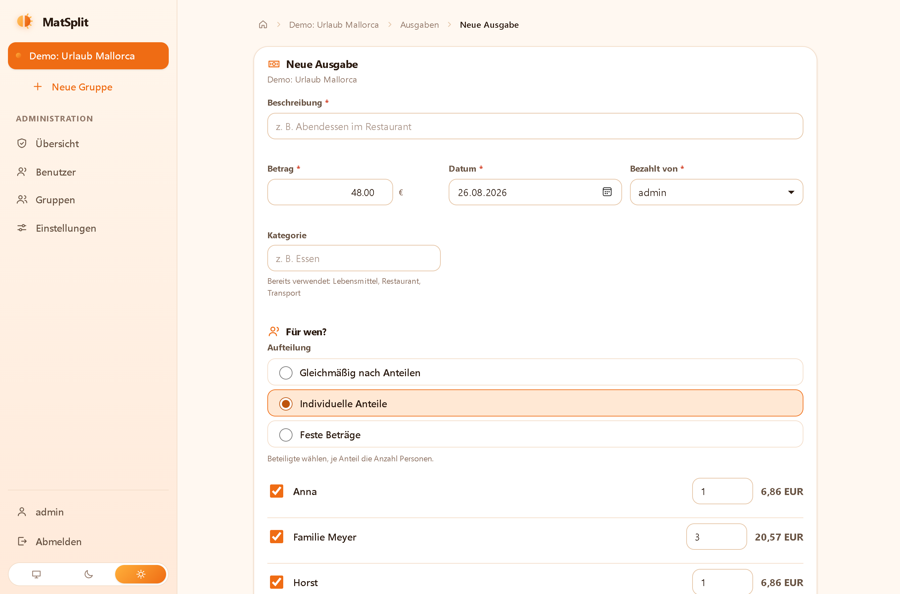
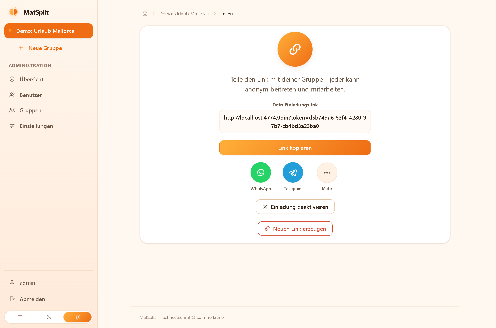
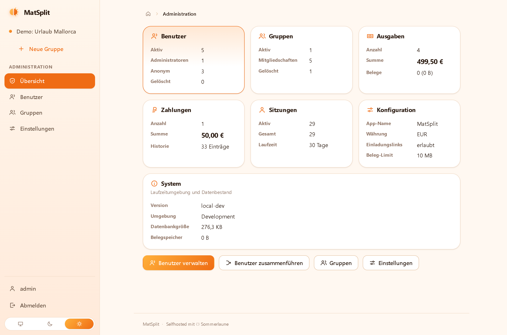
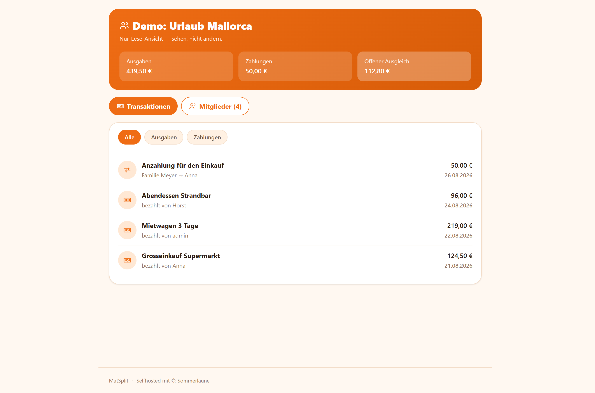
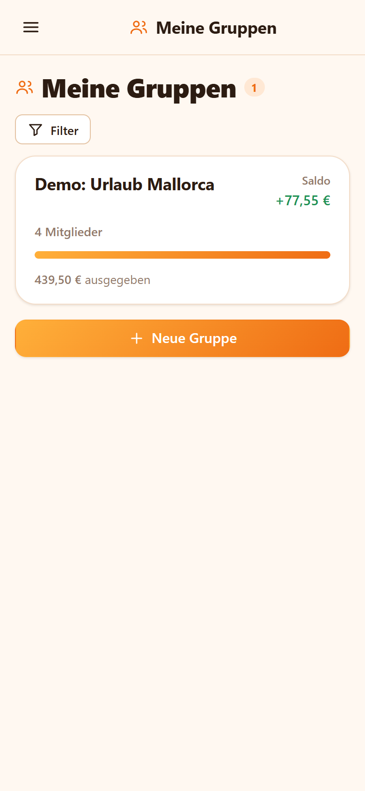
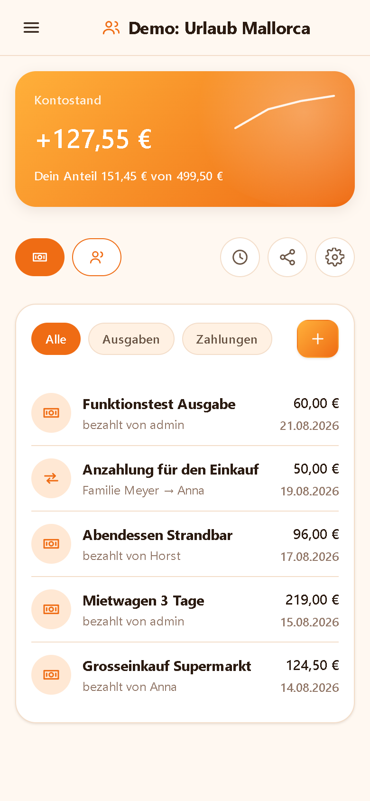

<div align="center">


# MatSplit

**Shared expenses for holidays and shared flats – in the browser.**

Create a group, add expenses, snap receipts with your phone, record who paid and see
who owes whom at the end – with a PayPal link to settle up.
One container, no cloud, no third-party services.

</div>



---

## What this is about

Splitting a holiday bill or the shared-flat groceries usually means a spreadsheet or handing
your data to yet another app. MatSplit is a self-hosted alternative to Splid: you run it in a
single Docker container, create a group, and everyone adds what they paid. It keeps track of
factors (a family counts as three people), fixed shares, receipts and payments, and works out
the **fewest transfers** that bring everyone back to zero.

Nobody needs an account: a group is shared through an **invite link**, and guests join with
just a name. When the trip is over, the balance shows who owes whom – with a `paypal.me` link
straight to the recipient.

## At a glance

**Groups & members**
- Groups for a holiday, a flat or a project – with currency, description and a full history
- Join through an **invite link** as an anonymous guest (no account) or as an existing user
- Add **managed members** by name only – people without a login that one person books for
- **Person count per member** (a family = 3), overridable per expense
- Merge duplicate guests ("Horst" and "Horsti" are the same person)

**Expenses & receipts**
- Amount, payer, date and category, split equally, by person count or by fixed amounts
- A **live preview** of each person's share while you type
- **Receipt photos** straight from the phone camera, shrunk in the browser before upload
- The combined **transaction list** merges expenses and payments into one timeline

**Balance & settling up**
- Per-member balance and the **minimal set of settlement transfers**
- Optional **`paypal.me` link** to the person who should receive the money
- Record a payment and book a suggested settlement as paid in one click

**Access & privacy**
- Cookie sign-in with its own session table; roles Admin / User / Anonymous, plus a
  per-group admin flag
- **Guests stay guests**: link members can neither open groups of their own nor pass the
  invite link on
- Share a **read-only link**: a public, view-only page of the balance and transactions –
  no login, no editing, off by default and revocable
- Everything runs on your machine – no telemetry, no external calls

**Interface**
- A **hub per group**: balance hero, a transaction tab and a members tab with filters
  (all / admins / users / guests)
- Installable **PWA**, offline-capable with background sync, tuned for iOS and Android
- **Light / dark / system** theme, a left menu on the desktop and a drawer on the phone

## Screenshots

### The group hub



The balance hero links to the detailed statement, the pill tabs switch between transactions
and members, and the icons on the right reach the history, the share screen and the group
settings. Every expense and payment lands in one chronological list.

### Balance and settling up



Who paid, what their share is and where they stand – followed by the fewest transfers that
even everyone out, each with a PayPal shortcut and a "book as paid" button.

### Members with filters



Filter the members by everyone, group admins, registered users or link guests. Group admins
add and edit memberships from here; the invite link lives on its own share screen.

### A new expense with a live share preview



Choose an even split, individual person counts or fixed amounts. In the individual mode every
participant shows their computed share right away – the exact cent split happens on save.

### Sharing and administration

| Share a group | Administration |
|---|---|
|  |  |

An invite link with copy, WhatsApp and Telegram shortcuts; and an admin area with users,
groups, settings and per-installation statistics.

### A public read-only link



Turn on a **read-only link** to show the current state of a group to anyone – balance,
settlements, transactions and members – without a login and without the ability to change
anything. It has its own token, is off by default and can be revoked at any time.

### On the phone

| Groups | Group hub |
|---|---|
|  |  |

## Quick start

Ready-made images are published to the GitHub Container Registry:

| Tag | Built from | Use it for |
|---|---|---|
| `ghcr.io/real-ttx/matsplit:latest` | `main` | releases |
| `ghcr.io/real-ttx/matsplit:nightly-*` | `dev` | the newest features |

### 1. Just run it

Copy this into `docker-compose.yml` and start it – nothing else needed:

```yaml
services:
  matsplit:
    image: ghcr.io/real-ttx/matsplit:latest
    container_name: matsplit
    restart: unless-stopped
    ports:
      - "4774:8080"
    volumes:
      - matsplit-data:/data

volumes:
  matsplit-data:
```

```bash
docker compose up -d
```

Open **http://localhost:4774** and sign in with **`admin` / `admin`** (health check:
`/health`). The first start also seeds a small demo group so the app is not empty. The
`matsplit-data` volume keeps the database, the configuration, the receipts and the session
keys, so an update is just `docker compose pull && docker compose up -d`.

> **Change the admin password** right after the first sign-in under *Konto*. Sign-in accepts
> the display name or the e-mail address, case-insensitively.

Without Compose:

```bash
docker run -d --name matsplit -p 4774:8080 -v matsplit-data:/data \
  ghcr.io/real-ttx/matsplit:latest
```

### 2. From source

```bash
docker compose up -d --build                              # release build
docker compose -f docker-compose.dev.yml up -d --build    # development stack (+ SQLite browser)
```

Locally without Docker (Windows host):

```powershell
dotnet run --project src/MatSplit.Web/MatSplit.Web.csproj
```

### Settings that matter

| Variable | Default | Meaning |
|---|---|---|
| `ASPNETCORE_ENVIRONMENT` | `Production` | `Development` turns on detailed error pages |
| `ASPNETCORE_URLS` | `http://+:8080` | Internal listener |
| `MATSPLIT_DATA_DIR` | `/data` | Root for db, config, receipts, keys and logs |
| `TZ` | `Europe/Berlin` | Container time zone |

TLS and the domain belong to a reverse proxy in front (nginx, Traefik, Caddy): forward to
`http://<host>:4774` and set `X-Forwarded-Proto` / `X-Forwarded-For` for correct redirects.
The service worker (and thus offline support) only activates over HTTPS or on `localhost`.

### After the first sign-in

The fields under *Administration → Einstellungen* apply to everyone and live in
`/data/config/appconfig.json`: application name, default currency, whether invite links are
allowed, the session lifetime, the maximum receipt size and the **receipt compression**
(on/off and a target size in KB, shrunk in the browser before upload).

### The `/data` volume

```
/data
├─ db/         SQLite database        → /data/db/matsplit.db
├─ config/     app configuration      → /data/config/appconfig.json
├─ receipts/   uploaded receipt files
├─ keys/       DataProtection keys (sessions survive restarts)
└─ logs/       log files
```

The directories are created inside the image and owned by the `app` user (uid/gid `1654`); a
fresh Docker volume inherits those permissions. For a **bind mount** the host directory must
belong to that user: `sudo chown -R 1654:1654 /srv/matsplit`.

## How it is built

- **ASP.NET Core 10** (Razor Pages), **EF Core** with SQLite; the schema is created on start
  via `EnsureCreated()` (no migrations yet)
- Cookie authentication with its own `UserSessions` table; sessions survive restarts because
  the DataProtection keys live on the `/data` volume
- **Money is always a `long` in cents** (`…Cents`) – never floating point
- The interface is server-rendered with a small `ms-*` tag-helper control library and **plain
  JavaScript** – no framework, no build step, no CDN, works offline
- Non-root container (`app`, uid `1654`) with a `HEALTHCHECK` on `/health`
- The interface is German; the code and its comments are English

## Branches & versioning

| Branch | Purpose | Version / tags |
|---|---|---|
| `main` | Release | `<major>.<minor>.<run>-<yyyyMMdd>` **and** `latest` |
| `dev` | Development | `nightly-<run>-<yyyyMMdd>` |
| local | – | `local-<yyyyMMdd>` |

`Major`/`Minor` live in [`Directory.Build.props`](Directory.Build.props); the build number is
the GitHub Actions run number, so there is no manual patch bookkeeping. Images are published
to the GitHub Container Registry. See the [CHANGELOG](CHANGELOG.md) for what changed between
versions and [docs/](docs/) for the architecture, the UI controls and the PWA notes.
